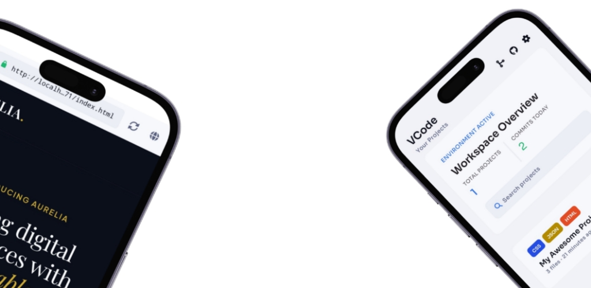
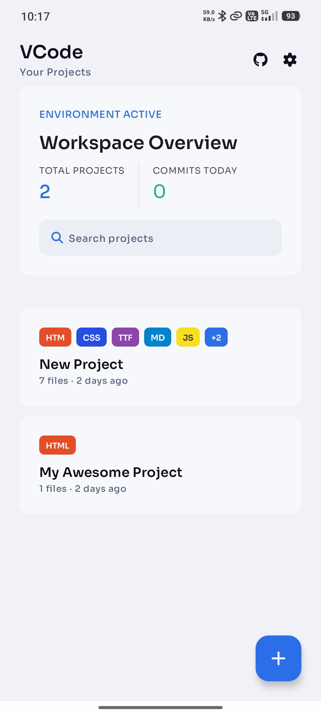
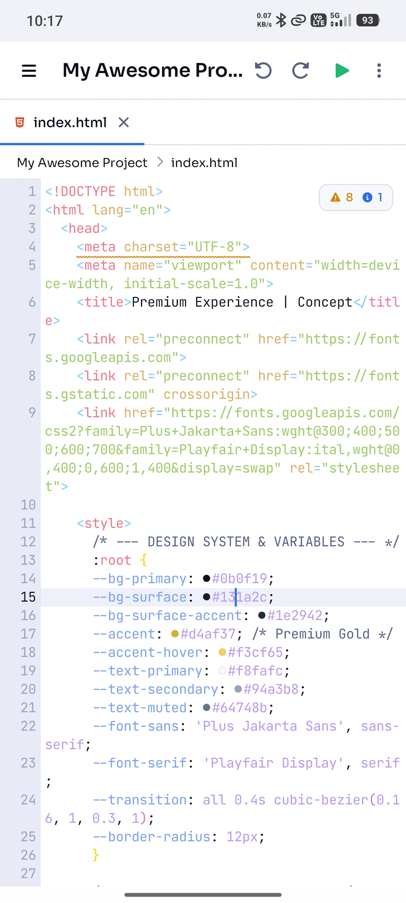
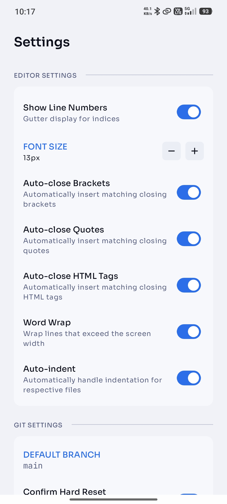
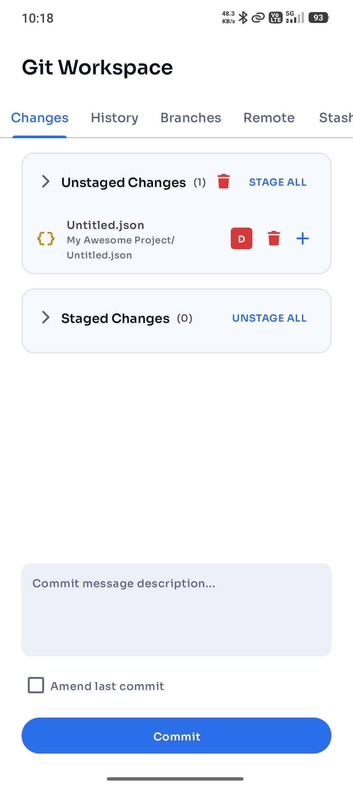
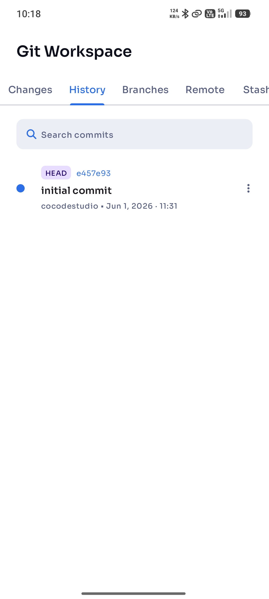
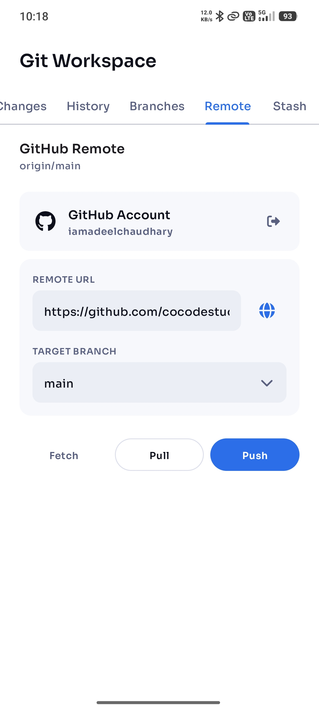
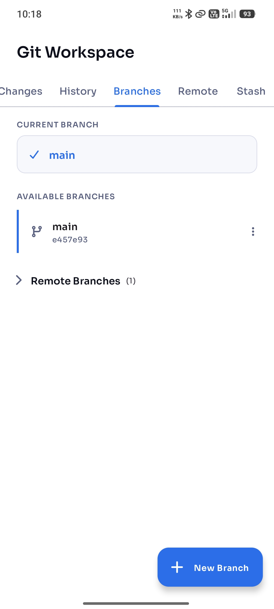
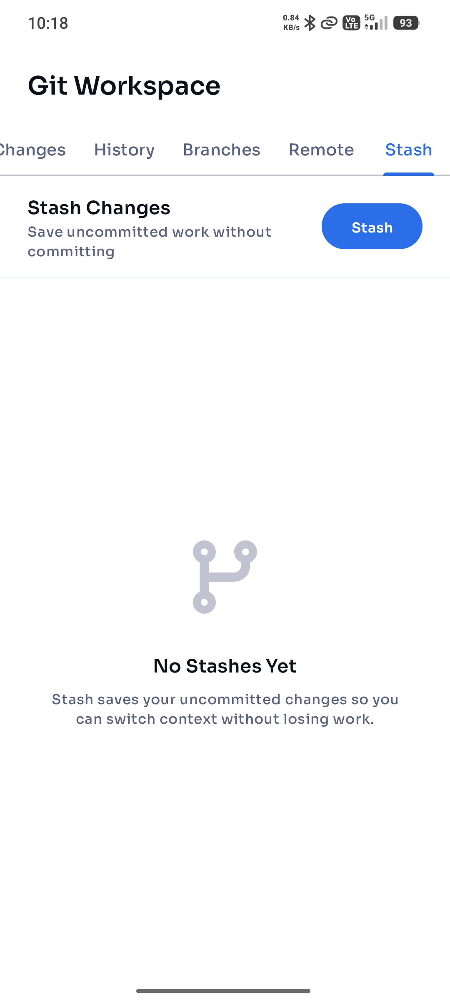

<div align="center">



# VCode — The IDE That Fits in Your Pocket

**A premium, blazing-fast mobile IDE for web developers — built natively for Android.**

[](LICENSE)
[](https://android.com)
[-orange.svg)]()
[]()
[](CONTRIBUTING.md)

[**▶ Download on Google Play**](https://play.google.com/store/apps/details?id=com.cocode.vcode.ide)

</div>

---

## 📖 About

VCode is a **desktop-grade coding environment** built entirely for Android. It is designed for web developers who want a genuine IDE experience — not a text editor with syntax coloring — right from their pocket.

Whether you're committing a hotfix on the go, prototyping a new idea during your commute, or managing a full project from your phone, VCode gives you the tools to do it properly.

> **Code anywhere. Preview instantly. Ship confidently.**

---

## 📸 Screenshots

<div align="center">
<table>
  <tr>
    <td align="center"><br/><sub>Projects</sub></td>
    <td align="center"><br/><sub>Code Editor</sub></td>
    <td align="center"><br/><sub>Settings</sub></td>
  </tr>
  <tr>
    <td align="center"><br/><sub>Git Changes</sub></td>
    <td align="center"><br/><sub>Commit History</sub></td>
    <td align="center"><br/><sub>Remote & GitHub</sub></td>
  </tr>
  <tr>
    <td align="center"><br/><sub>Branch Manager</sub></td>
    <td align="center"><br/><sub>Stash Manager</sub></td>
  </tr>
</table>
</div>

---

## ✨ Features

### ⚡ Blazing-Fast Code Editor
- Custom-built, high-performance editor with **viewport culling** and incremental syntax highlighting — no third-party editor library
- **Smart syntax highlighting** for HTML, CSS, JavaScript, TypeScript, and JSON rendered in JetBrains Mono
- **Context-aware autocomplete** — CSS inside `<style>` tags, JS inside `<script>` blocks, project-wide symbol discovery, and file path suggestions
- **Built-in Emmet expansion** — type `ul>li.item*3` or `!` and expand instantly into full code
- **One-tap code formatting** for HTML, CSS, JS, and JSON — cursor position preserved
- **Real-time diagnostics** — linting with color-coded squiggly underlines (red errors, yellow warnings, blue hints) at exact token positions
- **Find & Replace** with regex support and Go to Line
- Auto-closing brackets, smart auto-indentation, and undo/redo history

### 👁️ Live Previews
- **Live Web Preview** — render the active HTML file instantly in a built-in WebView or open in browser
- **Markdown rendering** — `.md` files render as rich, formatted documents
- **SVG, CSV, and Image previews** — files open in their visual representation
- **JSON Viewer** — formatted and syntax-highlighted

### 🌿 Full Git & GitHub Integration
- **Complete local Git workflow** — initialize, stage, unstage, commit, branch, merge, stash
- **GitHub connected** — link your account, push/pull/fetch, create repos, and manage remotes
- **Visual Diff Viewer** — review every change before committing
- **Commit History** — scrollable timeline with author, date, and message
- **Branch Manager** — create, switch, rename, and delete branches
- **Stash Manager** — save and restore work-in-progress with one tap
- **Conflict Resolution** — accept ours, accept theirs, or abort merge from a dedicated UI
- **Background cloning** — clone large repos without freezing the UI, with live progress

### 📁 Desktop-Grade File Management
- **Premium file tree** with long-press context menu for instant actions
- **Full clipboard support** — Copy, Cut, and Paste files and entire folders
- **Visual cut feedback** — cut items dim to 70% opacity, just like desktop OS
- **Background file operations** — import and paste large folders silently with progress notifications
- **Project templates** — Blank, HTML, or HTML+CSS+JS starter layouts

### 🎨 Polished UI
- **Material Design 3** with a fully polished dark theme
- Smooth micro-animations, transitions, and carefully tuned visual feedback throughout

---

## 🛠️ Building from Source

### Prerequisites
- Android Studio Hedgehog or later
- JDK 11+
- Android SDK with API 36

### Clone & Build

```bash
git clone https://github.com/cocodestudio/VCode.git
cd VCode
./gradlew assembleDebug
```

The debug APK will be at `app/build/outputs/apk/debug/app-debug.apk`.

### Technical Stack

| Concern | Approach |
|---|---|
| Language | Pure Java (Kotlin is not used) |
| UI | Native Android Views + XML layouts (no Jetpack Compose) |
| Networking | `HttpURLConnection` (no Retrofit) |
| JSON | `org.json` (no Gson / Moshi) |
| Database | File-based storage (no Room) |
| Concurrency | `ExecutorProvider` + `Handler` (no RxJava) |
| Git | `org.eclipse.jgit` |
| Min SDK | 23 (Android 6.0 Marshmallow) |
| Target SDK | 36 |

---

## 🤝 Contributing

Contributions are welcome and appreciated! Please read [**CONTRIBUTING.md**](CONTRIBUTING.md) for guidelines on how to get started, the coding standards we follow, and the pull request process.

---

## 📋 Changelog

See [**Release Notes**](https://github.com/cocodestudio/VCode/releases) for a full list of changes across versions.

---

## 📜 License

Distributed under the **Apache License 2.0**.  
See [`LICENSE`](LICENSE) for more information.

---

## 📬 Contact

- **Issues & Bug Reports**: [GitHub Issues](https://github.com/cocodestudio/VCode/issues)
- **Google Play**: [VCode on Play Store](https://play.google.com/store/apps/details?id=com.cocode.vcode.ide)

---

<div align="center">
<i>VCode — Stop settling for less. Code like a pro, from your pocket.</i>
</div>
